> 核心问题：在不明显降低 Agent 端到端任务成功率的前提下，如何让尽可能多的子任务在用户设备上的小模型（SLM）执行，从而减少云端大模型（LLM）的推理费用？

## 阅读信息与路径

- **论文**：*AIMS: Cost-Efficient LLM-based Agent Deployment in Hybrid Cloud-Edge Environments*，EuroSys 2026。
- **AIMS**：Adaptive Iteration-level Model Selector，自适应迭代级模型选择器。
- **整理日期**：2026-09-22。本文整合此前逐段讨论，重新核对正文与图表；解释性例子会明确写成例子，不冒充论文实验。
- **插图来源**：论文 PDF 页面直接渲染并裁剪为 PNG，保留原图中的坐标、图例和图注，不重新绘制实验数据。图片统一存放在本文的 `figures` 子目录中。

建议按以下顺序阅读：

1. [问题与核心矛盾](#1-问题为什么-agent-路由不同于普通请求路由)
2. [动机实验与四个观察](#2-motivation四个观察如何导出系统设计)
3. [系统设计](#3-design离线学习轨迹在线逐层调度)
4. [实验结果](#4-performance-evaluation系统到底带来了什么)
5. [局限、相关工作与结论](#5-局限相关工作与结论)
6. [Insights 汇总](#6-insights-汇总)
7. [术语与复习问题](#7-术语速查与复习问题)

---

## 0. 一页理解

一个普通请求通常只需要决定一次“用小模型还是大模型”。Agent 请求却会动态产生一串相互依赖的子任务：当前模型的输出不仅影响当前答案，还会决定下一步做什么。早期一次看似合理的路由可能改变后续任务链，最终造成完全不同的计算路径和任务结果。

AIMS 的核心做法是：先通过离线 profiling 学习 SLM 和 LLM 如何推进任务，再在运行时预测当前选择对后续路径的影响。它依次尝试整题本地执行、直接子任务匹配、延迟对齐、未来收敛和任务分解；只有这些方式都无法确认安全时，才回退到云端 LLM。

可以将论文压缩成下面这条链：

```text
问题：全云端太贵，独立路由会改变后续任务链
  ↓
观察：部分任务适合 SLM；后期更敏感；SLM 常需更多步骤才能收敛
  ↓
方法：离线 profiling + 在线 URC/SSE/SLE/CD/SD 分层调度
  ↓
结果：提高基线准确率与 SLM 使用率，平均云端费用约为 All-LLM 的 0.17×
  ↓
边界：需要模型对专属 profiling，没有显式 SLA，移动端可能更慢
```

---

## 1. 问题：为什么 Agent 路由不同于普通请求路由？

### 1.1 Agent 的成本来自反复调用模型

Agent 会把用户请求拆成多个步骤，并根据工具返回和中间状态继续生成下一步。例如，回答“1997 年电影《泰坦尼克号》导演的外祖父是谁”可能需要：

```text
确定导演 → 找到导演的母亲 → 查找母亲的父亲 → 验证身份
```

每一步都可能调用模型、携带历史上下文并产生新 token。云端 API 费用因此按多轮调用累积。论文研究的混合部署是：在手机、游戏笔记本等用户设备上运行 1B-4B 的 SLM，困难步骤再通过 API 调用 GPT-5、Claude 等云端模型。

这里的 computation breakdown 指**把不同请求或子任务分配到本地和云端**，不是把同一个神经网络按层切开。

### 1.2 独立路由的问题

HybridLLM 等传统方法主要判断当前请求或当前子任务是否适合 SLM。这个判断对独立请求可能有效，但 Agent 的子任务存在因果依赖：

```text
当前模型选择
   ↓
当前输出或状态变化
   ↓
下一子任务变化
   ↓
后续工具调用和推理路径变化
   ↓
最终任务成功率变化
```

因此，Agent 路由不能只问“这一步是否简单”，还要问“这一步交给 SLM 后，整个 Agent 会走到哪里”。

### 1.3 Figure 1：AIMS 位于 Agent 与模型之间

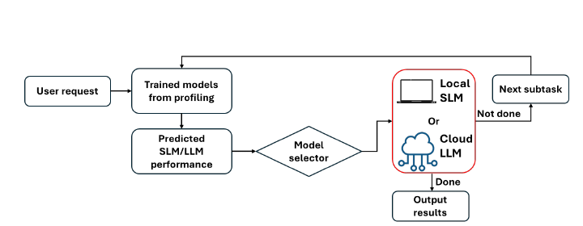

*原文 Figure 1，论文 PDF p.2。AIMS 用离线训练的预测器估计 SLM/LLM 表现，选择一个模型执行；若任务未完成，新子任务回到调度流程。*

图中的 `Trained models from profiling` 是辅助预测器，不是实际回答请求的本地 SLM 和云端 LLM。在线阶段通常不会先真实调用两个模型再比较，否则云端费用已经发生。

---

## 2. Motivation：四个观察如何导出系统设计？

### 2.1 动机实验设置与指标

作者使用 AutoGen 搭建 Agent，在 RTX 5090 上运行本地模型，比较两组模型：

| 本地 SLM | 云端 LLM |
|---|---|
| Qwen3-4B | GPT-5 |
| Gemma3-4B | Claude Sonnet 4 |

动机实验覆盖 GSM8K、HotpotQA、DROP、HumanEval 和 WebShop。不同数据集使用正确率、F1、pass@1 或 BERTScore 等不同指标，所以适合在同一数据集内比较方法，不宜直接比较不同数据集分数的绝对高低。

论文还定义：

- **Completion rate**：5 分钟内完成的请求比例。
- **Number of subtasks**：完成一个请求生成的子任务数量。
- **SLM usage**：请求中由 SLM 执行的子任务比例。
- **Output similarity**：SBERT 向量的余弦相似度，默认阈值为 0.7。

语义相似度是行为接近程度的代理指标，不等于最终任务必然正确；最终正确性仍按各数据集自己的标准评价。

### 2.2 观察 1：独立子任务路由仍有很大差距

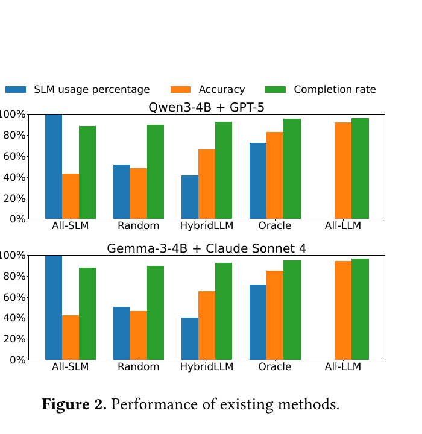

*原文 Figure 2，论文 PDF p.3。比较 All-SLM、Random、HybridLLM、Oracle 和 All-LLM。*

五种方法的含义：

| 方法 | 含义 |
|---|---|
| All-SLM | 所有步骤使用本地小模型 |
| All-LLM | 所有步骤使用云端大模型 |
| Random | 随机分配子任务 |
| HybridLLM | 独立判断每个子任务使用哪个模型 |
| Oracle | 枚举所有可能分配，在达到 All-LLM 90% 准确率的条件下最大化 SLM 使用率 |

跨数据集平均结果中，All-SLM 准确率为 42.95%，All-LLM 为 93.15%，HybridLLM 为 66.08%。Oracle 达到 84.05% 准确率和 72.25% SLM 使用率。相较 Oracle，HybridLLM 的准确率低 17.97 个百分点，SLM 使用率低 31.20 个百分点。

Oracle 不能直接在线部署，因为它需要枚举并知道不同分配的真实结果；它的价值是作为参考上界，说明理论上存在“**更多使用 SLM，同时获得更高准确率**”的调度空间。

Table 1 进一步表明，HybridLLM 相对 Oracle 的错误分配率在两组模型上分别达到 33.80% 和 35.70%。错误既包括不该用 SLM 时用了 SLM，也包括本可用 SLM 时却调用了 LLM。

> **观察 1：** 把 Agent 的每个子任务独立分给 SLM 或 LLM，无法同时优化最终准确率和 SLM 使用率；调度必须理解子任务之间的依赖。

### 2.3 观察 2：确实存在大量本地执行机会

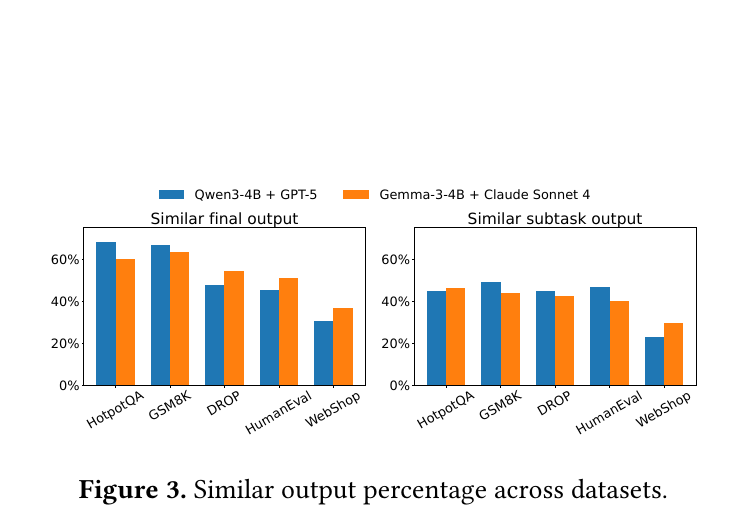

*原文 Figure 3，论文 PDF p.4。左图比较整题全 SLM/全 LLM 的最终输出，右图比较单个子任务输出。*

实验发现：

- 23.3%-44.9% 的完整请求，全 SLM 与全 LLM 的最终输出相似；
- 30.2%-68.9% 的子任务，SLM 能产生与 LLM 相似的输出。

不同任务的比例差异明显，但共同结论是：不能把所有任务交给 SLM，也没有必要让所有步骤调用 LLM。

> **观察 2：** 一部分完整请求和一部分子任务可以由 SLM 处理，并达到与 LLM 相近的输出。

### 2.4 观察 3：越靠后，模型切换影响越大

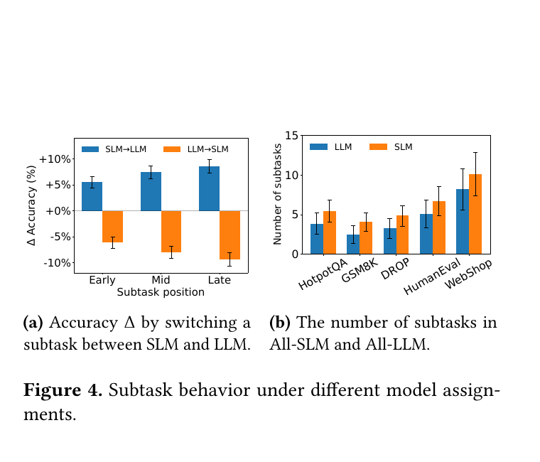

*原文 Figure 4，论文 PDF p.4。(a) 比较早、中、晚阶段切换模型的准确率影响；(b) 比较 All-SLM 与 All-LLM 的子任务数量。*

把一个步骤从 LLM 换成 SLM、其余步骤保持 LLM，平均准确率变化为：

| 子任务位置 | 准确率变化 |
|---|---:|
| Early | -5.25% |
| Middle | -7.59% |
| Late | -9.53% |

反向把一个步骤从 SLM 换成 LLM，准确率分别提高 5.14%、6.25% 和 9.40%。越接近最终答案，错误越难被后续步骤纠正。

> **观察 3：** 子任务位置会影响模型切换的准确率代价；后期步骤更敏感，路由阈值应随任务推进而收紧。

Figure 4b 只统计最终结果正确的请求：SLM 平均生成 6.37 个子任务，LLM 为 5.9 个。这个差异支持另一条重要 insight：**SLM 通常需要更多、更细的子任务，才能完成 LLM 用较少步骤完成的工作。**

### 2.5 观察 4：当前不同，不代表未来不能收敛

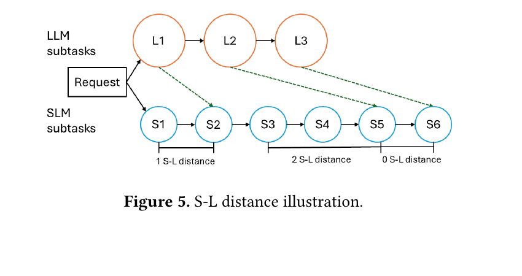

*原文 Figure 5，论文 PDF p.4。虚线连接语义匹配的 LLM 与 SLM 子任务。*

论文定义 **S-L distance**：对于一个 LLM 子任务，SLM 还需要额外执行多少个子任务，才能生成与它相似的状态。图中 L1 与 S2 匹配，距离为 1；L2 与 S5 匹配，距离为 2；L3 与 S6 直接对应，距离为 0；若找不到匹配，距离为无穷大。

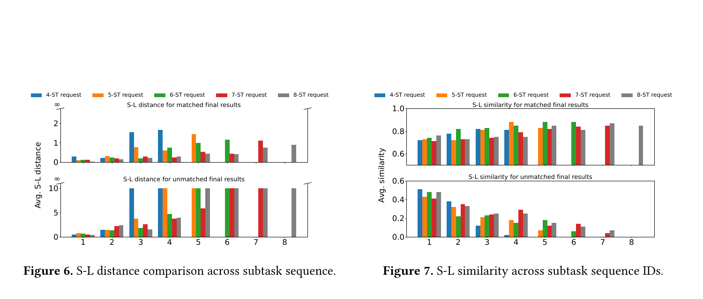

*原文 Figure 6-7，论文 PDF p.5。上半部分为最终结果匹配的请求，下半部分为最终结果不匹配的请求。*

最终结果匹配时，后期 LLM 里程碑可能需要更多 SLM 微步骤才能追上，但匹配状态的相似度总体提高。最终结果不匹配时，许多距离变成无穷大，相似度持续较低，表明路径已经不可恢复地偏离。

> **观察 4：** SLM 常通过更多子任务逐渐达到与 LLM 相似的结果。调度器不能只比较当前一步，还要判断 SLM 路径未来能否追上或重新收敛。

### 2.6 四个观察到系统组件的映射

| 动机观察 | 设计回应 |
|---|---|
| 独立路由忽略依赖 | 预测模型选择产生的下一子任务和未来路径 |
| 部分请求和子任务适合 SLM | 请求级 URC + 子任务级 SSE |
| 后期步骤更敏感 | 根据子任务序号动态提高相似度阈值 |
| SLM 需要更多步骤才能收敛 | DP、SLE、CD 和 SD |

---

## 3. Design：离线学习轨迹，在线逐层调度

### 3.1 两阶段设计

AIMS 使用两阶段设计：

- **离线 profiling**：采集 SLM 和 LLM 在历史请求上的任务轨迹，形成带标签的数据，再训练轻量预测器。
- **在线决策**：不同时真实运行两个目标模型，而是使用这些预测器估计大小模型的下一步、距离和收敛情况，为当前请求或子任务选择执行模型。

**Profiling** 可以理解为“通过受控实验建立行为档案”。在 AIMS 中，它不是只测一次吞吐或时延，而是对同一子任务分别尝试 SLM 和 LLM，记录输出、下一子任务、最终结果、相似度和路径对齐关系。

### 3.2 离线 profiling：构建子任务分支树

对于每个历史请求，AIMS 从根节点开始，在每个子任务上分别尝试 SLM 和 LLM。每个节点代表一个子任务，每条边代表一次模型选择；递归探索直到模型认为任务完成，或达到预设深度，例如 15 个子任务。

```text
                  当前子任务
                 /          \
            使用 SLM       使用 LLM
               ↓               ↓
       SLM 生成的下一步   LLM 生成的下一步
            /    \            /    \
          SLM    LLM         SLM    LLM
```

这类二叉探索可能产生较高的离线采集开销，但它为“当前选择如何改变未来路径”提供监督信号。

### 3.3 离线训练的组件

| 组件 | 输入 | 学习目标 |
|---|---|---|
| URC：User Request Classifier | 完整用户请求 | 预测全 SLM 与全 LLM 的最终结果相似度 |
| \(SP_{SLM}\) | 当前子任务 | 预测使用 SLM 后的下一子任务 |
| \(SP_{LLM}\) | 当前子任务 | 预测使用 LLM 后的下一子任务 |
| DP：Distance Predictor | LLM 子任务及其序号 | 预测 S-L distance |
| SD：Subtask Decomposer | 当前子任务和 LLM 预测的下一步 | 生成更简单的子任务序列 |

URC 和 DP 基于 ModernBERT；两个 SP 和 SD 基于 Qwen3-0.6B，并使用 LoRA 微调。辅助预测器合计约需要 2 GB 显存。

两个 SP 可以看作轻量路径模拟器。SSE、SLE 和 CD 使用它们推演未来，而不是为了比较输出先真实调用昂贵的云端模型。

### 3.4 Figure 8：分层决策漏斗

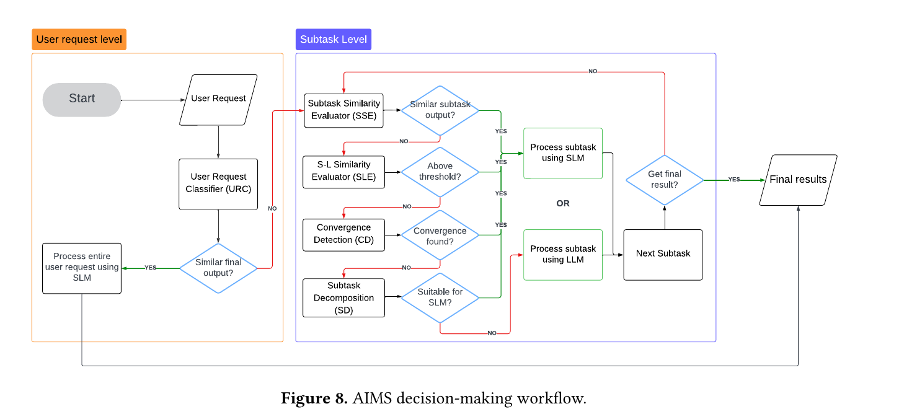

*原文 Figure 8，论文 PDF p.6。左侧为请求级，右侧为子任务级；绿色分支表示满足本地执行条件，红色分支进入更深检查或回退。*

Figure 8 是全文最重要的系统图。它可以概括为：

> **先在请求级寻找整题本地执行机会，再依次通过直接相似、延迟对齐、未来收敛和任务分解扩大 SLM 使用范围；所有检查都失败时，才回退到云端 LLM。**

#### 第一级：URC，整题是否适合 SLM

URC 预测全 SLM 与全 LLM 的最终输出相似度。若超过请求级阈值，例如 0.7，整个请求都使用 SLM；否则进入子任务级调度。

#### 第二级：SSE，下一子任务是否直接相似

SSE 分别使用 \(SP_{SLM}\) 和 \(SP_{LLM}\) 预测当前步骤之后的下一子任务。若两者相似，就把当前步骤交给 SLM。这里比较的是“下一步会走向哪里”，不只是当前文字答案。

SSE 使用位置感知阈值：

\[
\kappa = 0.6 + \min(ID, 5) \times 0.02
\]

早期阈值较低，允许一定差异；后期逐步收紧到约 0.7。

#### 第三级：SLE，SLM 能否多走 \(d\) 步追上

如果下一步不相似，DP 先预测 S-L distance \(d\)。SLE 比较 LLM 当前阶段与 SLM 向前执行 \(d\) 步后的预测状态。若相似，就让当前步骤及后续 \(d\) 步使用 SLM。

SLE 回答：“SLM 能否通过更多小步骤，追上 LLM 当前的位置？”

#### 第四级：CD，未来是否存在共同收敛点

如果 SLE 未通过，CD 同时向前推演 SLM 和 LLM 路径，寻找未来相似状态。发现多个收敛点时，选择最后一个，以扩大连续本地执行范围。

CD 回答：“两条路径都继续推进后，是否会在未来重新汇合？”

#### 第五级：SD，拆细后是否全部适合 SLM

若没有收敛点，SD 将复杂子任务拆成更简单的子任务。AIMS 对每个拆分步骤进行预测检查，采用 all-or-nothing 策略：全部适合才整组交给 SLM；只要一个不适合，就让 LLM 执行原来的复杂子任务。

这避免了某个错误小步骤污染后续结果，也避免拆分后产生更多 LLM 调用。

#### 执行与循环

图中的 `OR` 表示最终只执行 SLM 或 LLM 之一。若当前执行没有得到最终结果，Agent 生成 `Next Subtask`，新子任务重新从 SSE 开始调度。

### 3.5 fast path / slow path

AIMS 可以理解为级联式的 fast/slow path：

| 路径 | 含义 |
|---|---|
| Fast path | 预测器确认安全时，在本地 SLM 执行 |
| Recovery paths | SLE、CD 和 SD 尝试恢复更多安全的本地执行机会 |
| Slow path | 无法确认安全时，回退到云端 LLM |

检查顺序从最直接、收益最大的整题判断，逐步走向更复杂的路径推演和任务重写。它的设计目标不是永远避免 LLM，而是让昂贵的 LLM 成为准确率关键步骤的回退路径。

### 3.6 AIMS 如何克服“独立路由”

HybridLLM 的判断近似为：

```text
只看当前子任务 → 选择 SLM 或 LLM
```

AIMS 的判断是：

```text
当前子任务特征
+ 预测的下一子任务
+ 当前在任务链中的位置
+ SLM 是否能多走几步追上
+ 两条路径未来能否收敛
+ 任务拆细后是否全部安全
→ 选择 SLM 或 LLM
```

AIMS 仍然逐子任务作出动作，但决策依据已经从当前步骤扩展到预测的执行轨迹。

---

## 4. Performance Evaluation：系统到底带来了什么？

### 4.1 训练与测试设置

作者使用 Qwen3-4B + GPT-5 在 WorFBench 和 GSM8K 上生成 1,000 条完整子任务轨迹，微调全部辅助预测器约需一张 A100 运行 2 小时。测试覆盖 HotpotQA、GSM8K、DROP、HumanEval、WebShop、MATH、WebArena、WorFBench 和 ToolBench。

主要基线：

- **HybridLLM**：分类器独立路由每个子任务。
- **Minions**：本地模型先尝试，根据平均 token 对数概率判断不确定性并升级到云端。
- **All-SLM / All-LLM**：两个端点参考。

### 4.2 准确率与 SLM 使用率

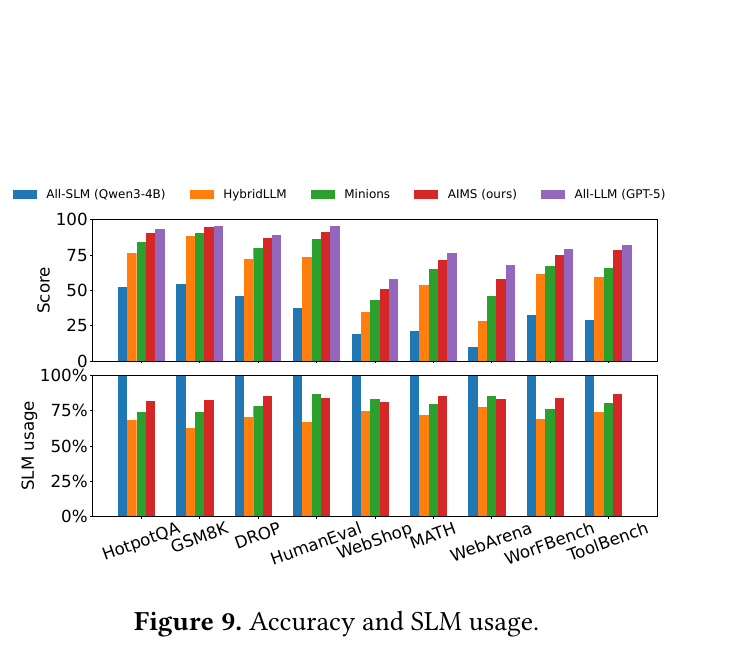

*原文 Figure 9，论文 PDF p.9。不同数据集的 Score 指标不完全相同，应在每个数据集内部比较。*

部分代表性结果：

| 数据集 | HybridLLM | Minions | AIMS |
|---|---:|---:|---:|
| HotpotQA | 76.35 | 84.20 | **90.75** |
| HumanEval | 73.65 | 86.10 | **91.45** |
| WebShop | 34.75 | 43.10 | **51.20** |
| WebArena | 28.60 | 45.70 | **57.90** |
| ToolBench | 59.40 | 66.10 | **78.35** |

HotpotQA 上，AIMS 的 SLM 使用率为 81.85%，也高于 HybridLLM 的 68.40% 和 Minions 的 74.10%。这说明其质量提升不是靠更多调用 GPT-5 换来的。

HumanEval 上 Minions 的 SLM 使用率略高于 AIMS（86.95% 对 84.10%），但 AIMS 的任务分数更高。SLM 使用率不能脱离准确率单独评价；All-SLM 可以达到 100% SLM 使用率，却往往牺牲任务质量。

摘要中的“27.5%”是相对准确率提升，不是增加 27.5 个百分点；论文同时报告部分比较中的绝对提升约为 12-17 个百分点。

### 4.3 端到端延迟

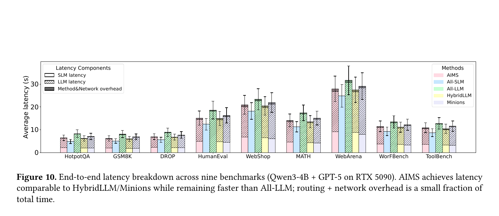

*原文 Figure 10，论文 PDF p.10。环境为 Qwen3-4B + GPT-5、RTX 5090。*

九个数据集的平均端到端延迟：

| 方法 | 平均延迟 |
|---|---:|
| All-SLM | 11.14 秒 |
| HybridLLM | 12.98 秒 |
| AIMS | **13.33 秒** |
| Minions | 14.21 秒 |
| All-LLM | 15.82 秒 |

AIMS 的调度与网络开销约占总时间的 3%-7%，平均网络跳转延迟约为 0.58 秒。在 RTX 5090 上，它与 HybridLLM/Minions 相近，并快于 All-LLM。

这个结论依赖本地硬件。保持相同路由策略和 SLM 使用率时，iPhone 15 上 AIMS 的延迟达到 All-LLM 的 2.52 倍。多用本地模型可以省云端费用，但不保证更快。

### 4.4 云端费用

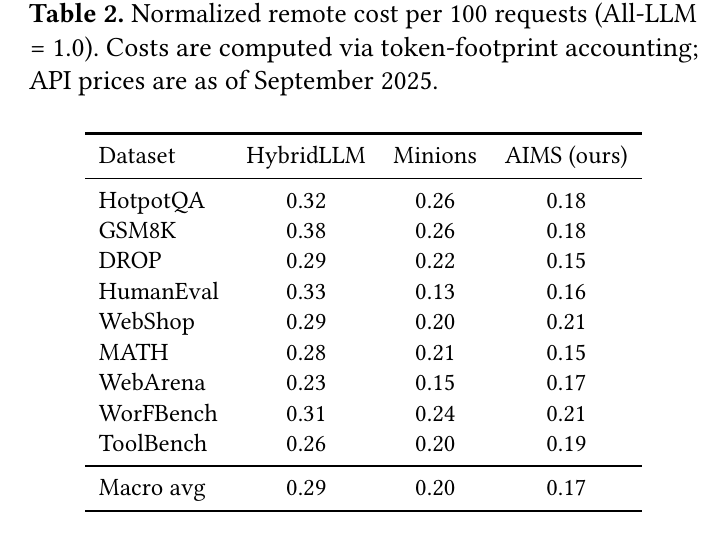

*原文 Table 2，论文 PDF p.10。All-LLM 归一化为 1，API 价格截至 2025 年 9 月。*

九个数据集宏平均：

| 方法 | 相对 All-LLM 的云端费用 |
|---|---:|
| HybridLLM | 0.29× |
| Minions | 0.20× |
| AIMS | **0.17×** |

论文据此计算 AIMS 相比 All-LLM、HybridLLM 和 Minions 分别节省约 83%、41% 和 15% 的远端费用。这个成本只按输入/输出 token 与 API 单价计算，把本地执行视为免费，也忽略边云传输费。

AIMS 并非每个数据集都最便宜。例如 HumanEval 和 WebArena 上 Minions 的远端费用更低，但 AIMS 的准确率更高。因此合理结论是 AIMS 改善了整体准确率-成本折中，而不是所有单项都占优。

### 4.5 模型与硬件泛化

| 模型组合 | 相比 HybridLLM 的准确率提升 | 相比 Minions 的提升 | 相对 All-LLM 费用 |
|---|---:|---:|---:|
| Qwen3 + GPT-5 | +12.35 | +6.86 | 0.17× |
| Gemma3 + Claude Sonnet 4 | +13.14 | +6.18 | 0.22× |

这表明方法可迁移到另一组 SLM/LLM，但不表示预测器无需重新 profiling。移动设备实验则说明路由和准确率收益可以保持，而本地吞吐量会决定最终延迟。

### 4.6 组件消融

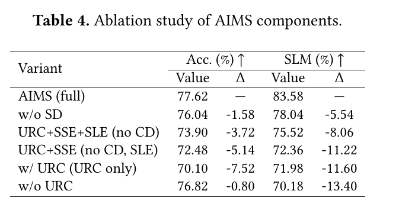

*原文 Table 4，论文 PDF p.11。完整系统同时获得最高准确率和 SLM 使用率。*

完整 AIMS 为 77.62% 准确率和 83.58% SLM 使用率。去掉 SD 后分别降至 76.04% 和 78.04%；继续移除 CD、SLE，两个指标进一步下降。只保留 URC 时为 70.10% 和 71.98%。

去掉 URC 后准确率仅下降 0.80 个百分点，但 SLM 使用率下降 13.40 个百分点，说明 URC 的主要作用是快速识别可以整题本地执行的请求。CD、SLE 和 SD 则在保持质量的同时暴露更多细粒度本地机会。

### 4.7 Profiling 数据量

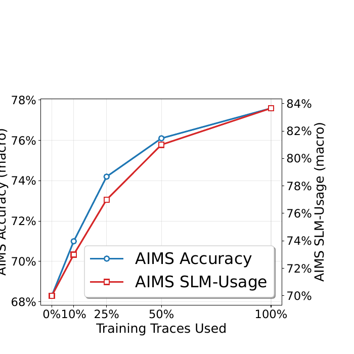

*原文 Figure 11，论文 PDF p.11。横轴是使用的 profiling 轨迹比例。*

训练轨迹从 0% 增至 100% 时，准确率由 68.3% 升至约 77.5%，SLM 使用率由 69.5% 升至约 83.6%。使用 50% 轨迹时已达到 76.1% 准确率和 81.2% SLM 使用率，之后边际收益减小。

辅助预测器在训练数据上的准确率约为 82.1%-84.1%，在其余数据集上的泛化准确率约为 75.1%-77.9%。每 500 个新请求使用最近轨迹进行持续 LoRA 微调，可将泛化准确率提高到约 78.1%-81.3%。预测器并不完美，这也是 AIMS 只能经验性维持准确率、不能提供严格保证的原因之一。

### 4.8 参数敏感性

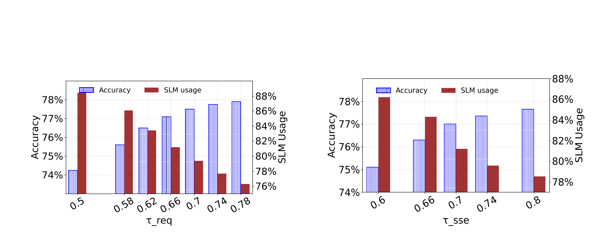

*原文 Figure 12，论文 PDF p.12。提高阈值会提高准确率、降低 SLM 使用率。*

请求级阈值从 0.50 提高到 0.78 时，准确率由 74.25% 升至 77.90%，SLM 使用率由 88.40% 降至 76.30%；论文建议的折中区间约为 0.66-0.70。

子任务相似度阈值从 0.60 提高到 0.80 时，准确率由 75.10% 升至 77.65%，SLM 使用率由 86.20% 降至 78.55%；折中区间约为 0.70-0.74。

阈值因此是部署策略，而不是越高越好：高风险应用可提高阈值，成本敏感应用可降低阈值。

### 4.9 性能差异来自哪里

作者分析 AIMS 正确、HybridLLM 和 Minions 错误的 100 条轨迹，发现两个主要失败模式：

- **Early divergence accumulation**：早期步骤看似简单，但 SLM 改变了状态和下一子任务，偏差持续累积。
- **Late-stage sensitivity**：后期涉及最终动作、参数验证或一致性检查，局部错误更容易直接造成任务失败。

在 150 个性能差异案例中：

| 原因 | HybridLLM | Minions |
|---|---:|---:|
| 早期偏差累积 | 53.18% | 30.07% |
| 后期步骤敏感 | 29.64% | 45.86% |
| 缺少收敛和分解机制 | 17.18% | 24.07% |

这与方法机制一致：HybridLLM 主要受早期独立路由影响，Minions 主要受后期局部置信度判断影响。该分析是对轨迹的事后归类，可以支持机制解释，但不是严格的因果实验。

---

## 5. 局限、相关工作与结论

### 5.1 论文明确承认的局限

| 局限 | 当前做法 | 后续方向 |
|---|---|---|
| 应用准确率要求不同 | 所有应用使用统一相似度阈值 | 让应用提供风险或准确率目标 |
| 成本模型简化 | 主要计算云端 API token 费用 | 加入本地能耗、网络、排队、多租户和资源利用率 |
| Profiling 成本较高 | 每个 SLM/LLM 组合都要收集轨迹 | 复用已有模型对的信息、迁移预测器 |
| 只选择一对模型 | 一个 SLM 与一个 LLM 二选一 | 扩展到多个本地、边缘和云端模型 |
| 没有显式 SLA | 优化 SLM 使用率并经验性报告延迟 | 接收费用预算 \(B_\$\) 和延迟预算 \(B_t\)，动态调整阈值和搜索深度 |

SLA-aware AIMS 还需要网络 RTT、设备吞吐量、队列长度和资源利用率等运行时信号。当前版本不能保证每个请求在指定费用或时间内完成。

### 5.2 与相关工作的关系

| 研究方向 | 解决的问题 | 与 AIMS 的关系 |
|---|---|---|
| ReAct、AutoGen 等 Agent 方法 | 如何规划、使用工具和组织推理 | AIMS 可作为底层模型路由层 |
| LangGraph、Semantic Kernel | 如何定义工作流、管理状态、集成工具 | AIMS 可放在框架下面，为每一步选择执行模型 |
| HybridLLM | 分类器在大小模型间路由 | 不建模 Agent 内部依赖和位置 |
| Minions | 本地模型不确定时升级云端 | 主要使用局部置信度，不预测后续任务结构 |
| PagedAttention、SpecInfer 等 serving 优化 | 已选定模型后如何提高推理吞吐和效率 | 与 AIMS 正交，可组合使用 |

AIMS 的定位是 **fine-grained、position-aware、dependency-aware routing**：细粒度、位置感知和依赖感知的 Agent 路由。

### 5.3 论文结论

论文证明的主要结论是：在具有较强本地算力、云端 API 费用占主导的环境中，基于子任务位置和预测执行路径进行调度，能够比独立路由获得更好的任务质量与云端费用折中。

最重要的研究思想不是某个阈值或分类器，而是判断单位的变化：

```text
传统路由：当前请求或当前子任务

AIMS：当前子任务
    + 它会生成的下一子任务
    + 它在任务链中的位置
    + 未来能否追上或重新收敛
```

---

## 6. Insights 汇总

本节保留此前讨论中明确要求记忆的全部 insights，并补充它们之间的逻辑关系。

### Insight 1：Oracle 揭示理论空间

Oracle 表明存在“更多使用 SLM，同时获得更高准确率”的调度空间。HybridLLM 同时落后于 Oracle 的准确率和 SLM 使用率，说明问题不只是小模型能力不足，路由策略本身也有显著改进余地。

### Insight 2：SLM 通常需要更多子任务

在最终结果正确的请求中，SLM 平均生成 6.37 个子任务，LLM 为 5.9 个。当前输出不同可能只是粒度不同；如果只要求逐步立即匹配，会错失小模型通过更多微步骤完成任务的机会。

### Insight 3：四个动机观察

1. 独立分配每个子任务会忽略依赖，无法同时优化准确率和 SLM 使用率。
2. 部分完整请求和部分子任务可以由 SLM 处理。
3. 越靠后的步骤，SLM/LLM 切换对最终准确率影响越大。
4. SLM 常通过更多步骤逐渐收敛到 LLM 的输出，调度需要检查未来收敛。

### Insight 4：AIMS 是离线学习、在线决策的两阶段系统

- 离线 profiling 采集大小模型任务轨迹并训练轻量预测器。
- 在线决策利用预测器判断整个请求或当前子任务该交给哪个模型。

Profiling 在这里指：对历史任务进行受控分支探索，记录模型选择、下一子任务、最终结果、相似度和路径对齐关系，形成可供预测器学习的行为档案。

### Insight 5：fast path / slow path

本地 SLM 是常见且低云端成本的 fast path；云端 LLM 是准确率关键步骤的 slow path。SLE、CD 和 SD 是结构化恢复路径，它们在不接受不可恢复偏离的前提下，扩大 fast path 的覆盖范围。

### Insight 6：Figure 8 是分层决策漏斗

Figure 8 的信息可压缩为：

```text
整题适合 SLM？
  ↓否
当前下一步直接相似？
  ↓否
SLM 多走 d 步能追上？
  ↓否
未来存在收敛点？
  ↓否
拆细后是否全部适合 SLM？
  ↓否
回退云端 LLM
```

它不是五个平行分类器，而是一条从低成本直接判断到复杂恢复策略的级联路径。

### Insight 7：Agent 路由的单位是预测轨迹

AIMS 克服独立路由问题的本质，是让每次子任务决策包含下一步、任务位置和未来路径信息。可复用的研究结论是：

> **Agent 模型路由不能只判断当前步骤是否简单，而要判断这次选择会把后续执行带到哪里，以及路径能否重新回到正确方向。**

---

## 7. 术语速查与复习问题

### 7.1 术语速查

| 术语 | 含义 |
|---|---|
| SLM | 运行在用户或边缘设备上的小语言模型 |
| LLM | 通过云端 API 使用的能力更强的大语言模型 |
| Subtask | Agent 在一次迭代中动态产生的步骤或行动 |
| Profiling | 通过历史任务实验建立模型行为与路径档案 |
| S-L distance | SLM 还需多少额外步骤才能匹配某个 LLM 子任务 |
| S-L similarity | SLM 与 LLM 对齐状态的语义相似度 |
| URC | 判断整个请求是否适合全 SLM |
| SSE | 比较当前步骤下大小模型预测的下一子任务 |
| SLE | 判断 SLM 多走若干步后能否追上 LLM 当前状态 |
| CD | 向未来搜索 SLM/LLM 路径收敛点 |
| SD | 将复杂子任务拆成更简单的子任务 |
| Position-aware | 根据子任务在任务链中的位置调整路由标准 |
| Macro average | 先算各数据集指标，再给予每个数据集相同权重求平均 |

### 7.2 容易混淆的口径

- 83.4% SLM usage 是**子任务比例**，不是 token 比例，也不是端到端费用恰好下降 83.4%。
- 27.5% 是**相对提升**；从 60% 到 76.5% 是相对提升 27.5%，绝对提升 16.5 个百分点。
- “与 All-LLM 准确率相近”是宏平均经验结果，不表示每个数据集、每个请求都相同。
- 输出语义相似不等于工具参数、数字或代码行为一定正确。
- AIMS 降低的是论文成本模型中的远端 API 费用，本地算力和电量没有计入。
- 桌面 GPU 上更快不代表手机上也更快；iPhone 15 实验反而慢于 All-LLM。

### 7.3 复习问题

1. 为什么把普通请求路由器直接应用到每个 Agent 子任务会失败？
2. Oracle 的意义是什么，为什么它不能直接部署？
3. S-L distance 与文本相似度分别描述什么？
4. 为什么 SLM 生成更多子任务不一定是失败信号？
5. SSE、SLE 和 CD 的判断对象有何区别？
6. 为什么后期步骤需要更高相似度阈值？
7. SD 为什么采用“全部拆分步骤都适合，才全部使用 SLM”的策略？
8. AIMS 的 profiling 采集了什么，为什么更换模型对可能需要重做？
9. 论文的 0.17× 成本包含哪些费用，又忽略了哪些费用？
10. 如果要让 AIMS 满足每请求 SLA，需要增加哪些输入和运行时信号？
