> 核心问题：当一个用户任务涉及多个模型和工具时，如何联合选择工作流参数、模型和硬件，在满足质量与时延要求的前提下减少资源、能耗和成本？

## 阅读信息与路径

- **论文**：*Murakkab: Resource-Efficient Agentic Workflow Orchestration in Cloud Platforms*。
- **整理日期**：2026-09-21。本文整合此前逐段讨论，重新核对原文，并区分论文陈述、解释性例子与阅读评价。
- **插图来源**：论文 PDF 页面直接渲染后裁剪为 PNG，保留原图、坐标、图例与图注，不重新绘制实验数据。图片统一存放在本文的 `figures` 子目录中。文中页码均为整理时所用 PDF 的页码。
- **命名**：Murakkab 意为“compound”，即“复合的、由多个部分组成的”。本地 v2 没有明确解释这个名字；作者在[后来的论文版本第一页脚注](https://goharirfan.me/publications/murakkab_osdi_2026_paper.pdf)中说明它是乌尔都语／波斯语词，指由多个构件组成的 Agent 工作流。本笔记的设计和实验仍以本地 v2 为准。

建议按以下顺序读：

1. [研究对象与概念](#1-研究对象agentic-ai-serving-服务什么)
2. [问题与三个 Insight](#2-问题为什么需要-murakkab)
3. [系统设计与模块职责](#3-design从逻辑工作流到可执行工作流)
4. [实验及证据边界](#4-evaluation每组实验验证什么)
5. [结论与进一步思考](#5-结论与阅读评价)
6. [术语与复习问题](#6-术语速查与复习问题)

---

## 1. 研究对象：Agentic AI Serving 服务什么？

### 1.1 从一次模型推理到一项完整任务

一次普通模型推理接收 prompt，经过 prefill 和 decode，输出 token。一个 Agent 任务则可能包含多次模型推理、工具调用、结果检查和重试。前一步的输出会成为后一步的输入，有时也会改变后续行动。

因此，在这组论文的语境下，可以将 **Agentic AI Serving** 理解为：管理完整 Agent 任务涉及的模型调用、工具执行和中间状态，并以任务级成功率、端到端时延和总资源开销为目标进行优化。

需要区分三个单位：

| 单位 | 例子 | 关注点 |
|---|---|---|
| 用户任务 | 回答视频问题、生成可通过测试的代码 | 最终质量、完成时间、总成本 |
| 工作流步骤 | 抽帧、语音转文字、生成候选代码、评审答案 | 步骤依赖、执行器选择、资源安排 |
| 模型调用 | 某次 prompt 的 prefill 和 decode | 吞吐、token 时延、缓存、显存利用率 |

Murakkab 将完整工作流暴露给资源管理系统，使下层决策能够考虑上层任务目标。它的范围包括预先定义的多模型、多工具工作流，以及组合式 Agent 模式；不要求所有节点都具有自主规划能力，也不要求所有流程都在运行时临时生成。

### 1.2 两个贯穿全文的工作流

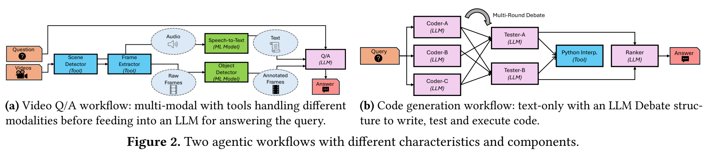

*原文 Figure 2，p.2。左侧看数据如何分支并汇合，右侧看多个模型调用如何形成辩论结构。*

- **视频问答**：检测场景，抽取视频帧并转录音频，按需进行物体检测，最后由多模态模型结合处理后的画面和文字回答问题。可调选项包括抽帧数、是否启用 STT、模型选择。
- **代码生成**：多个辩论者生成候选方案，使用执行或测试结果进行多轮讨论，再选择最终方案。可调选项包括辩论者数量、轮数和模型。

视频问答展示了多模态和不同资源需求；代码生成展示了多模型调用及推理轮数对质量和开销的影响。数学问答的补充实验放在附录。

### 1.3 SLO 与多租户

**SLO（Service Level Objective）** 是可量化的服务目标，例如准确率至少达到某个档位、请求在某个时间内完成、成本不超过某个预算。优化器把这些要求作为约束，在满足约束的配置中降低成本或能耗。

质量 SLO 依赖评估数据上测得的统计质量，不能理解为系统保证每一道具体问题回答正确。时延要求也需要结合论文采用的统计口径理解；TTFT、TPOT 和整个工作流完成时间是不同指标。

**Tenant（租户）** 是独立的服务使用方，可以是用户、团队、公司或应用。Multi-tenant 表示多个租户共享服务基础设施。一个租户可以拥有多个工作流，工作流数量与租户数量不必相等。Murakkab 重点研究共享资源时的效率与 SLO；安全隔离并非本文的主要贡献。

### 1.4 与另外三篇已讨论论文的关系

以下是阅读定位，不表示这四套系统已经完成集成。

| 论文 | 主要优化层次 | 主要问题 |
|---|---|---|
| Murakkab | 工作流与集群 | 联合选择参数、模型、硬件，并跨工作流共享资源 |
| AIMS | Agent 的迭代步骤 | 每一步由本地小模型还是云端大模型执行，如何控制对最终质量的影响 |
| Agent-X | 端侧 Agent 的模型推理 | 利用输入输出规律改善前缀缓存和推测解码，降低任务时延 |
| FlashGen | 多轮上下文与请求调度 | 保存历史 KV、减少重复计算、改善显存利用率 |

FlashGen 直接研究多轮对话，它提供与 Agent 连续调用有关的基础能力；多轮聊天本身不自动等于 Agent 工作流。

## 2. 问题：为什么需要 Murakkab？

### 2.1 Opaque：平台看到调用，却看不到任务整体

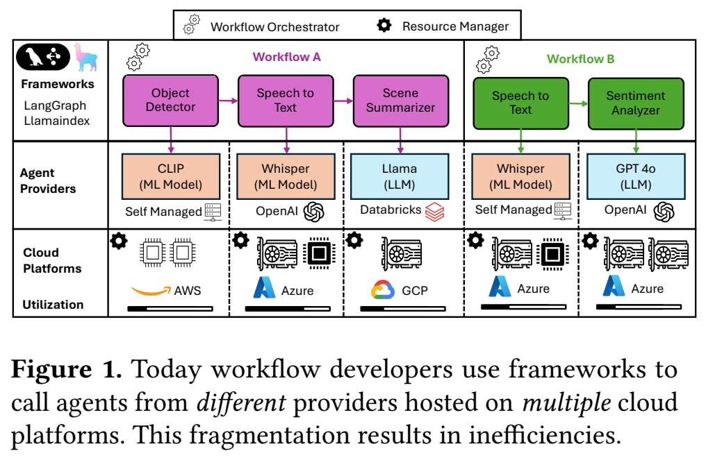

*原文 Figure 1，p.1。不同工作流的构件分布在不同提供方与云平台，控制和信息分散。*

摘要说现有系统将工作流暴露为“opaque sequences of model and tool calls”。**Opaque 是相对于底层服务和资源优化器而言的**：它们看见了模型请求，却未必知道请求属于哪个用户任务、有什么依赖、哪些步骤可以并行、最终的质量和时延目标是什么。

知道单个模型的队列长度，并不足以判断加速这个模型是否会缩短整个工作流的完成时间；缺少上层结构，也难以决定某一步能否换成更省资源的配置。

### 2.2 Rigid and Imperative Definitions

开发者经常把三类决策写进同一个工作流定义：

| 层次 | 例子 |
|---|---|
| 任务与数据依赖 | 检测场景后抽帧、转录，再回答问题 |
| 工作流及节点参数 | 是否启用 STT、抽取 15 帧、选择某个模型 |
| 资源配置 | 使用 H100、分配 8 张 GPU、采用某个并行度 |

这就是 **tight coupling**：应用逻辑和执行配置紧密绑定。**Static** 表示选择在开发或部署时固化；**imperative** 表示开发者直接指定具体执行方式；**brittle/rigid** 表示这些假设变化时，需要联动修改和重新部署。

准确地说，论文批评的是这种配置与逻辑耦合的使用方式。命令式语言并非天然不能动态配置，声明式写法也不会自动解决资源管理；关键在于接口是否将可调配置暴露给优化器。

### 2.3 Fragmented Stack and Goals

开发者关心质量和时延，最终用户还关心使用费用，云平台关心资源效率与成本。但工作流配置的责任主要落在开发者身上，他们通常没有集群全局视图；平台掌握资源，却缺少工作流内部信息。

三个配置层次相互影响：

- **Workflow-level knobs**：是否包含某个步骤，例如语音转文字。
- **Agent/node-level knobs**：每个步骤怎样执行，例如抽帧数量、采用哪个 LLM。
- **Hardware-level knobs**：使用 CPU/GPU、哪种 GPU、采用多大并行度。

例如开启 STT 会引入额外计算，同时改变最终问答模型的上下文；这会影响模型负载、端到端时延和资源需求。各层分别优化，很容易产生局部合理、整体低效的结果。

§2.3 强调缺少自动调整配置的空间；§2.4 强调信息、控制权和目标分散，难以进行统一决策。

### 2.4 三个 Insight

| Insight | 原文的主要观察 | 系统设计所需能力 |
|---|---|---|
| **1：缺少双向可见性** | 云平台看不到工作流内部任务和要求；开发者看不到或难以控制系统资源行为 | 将任务图、SLO 和资源状况交给统一系统 |
| **2：跨层权衡** | 工作流和 Agent 参数影响质量与时延/成本；硬件参数进一步影响成本、性能和能效 | 用测量数据连接质量、工作量与硬件表现，联合选择配置 |
| **3：配置组合爆炸** | Agent 数量和各层参数共同放大配置空间，人工选择不可行 | 自动优化，并随运行环境变化更新方案 |

#### Insight 1：端到端信息决定能否优化

懂工作流的框架和管理 GPU 的平台需要共享信息。例如，只有知道两个分支最终要汇合，系统才能判断其中一个分支可以稍微变慢，转而使用 CPU 节省 GPU。

#### Insight 2：准确率提高往往需要付出额外开销

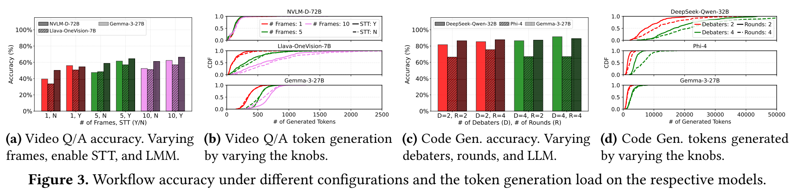

*原文 Figure 3，p.4。(a)(c) 看质量，(b)(d) 看生成 token 数的分布，不能只看平均开销。*

视频问答使用 Gemma-3-27B、抽取 10 帧并启用 STT，在所比较配置中达到 66.2% 准确率，但相较同模型的其他配置也产生更多 token。代码生成中，相同工作流设置下，DeepSeek-Qwen-32B 的生成 token 中位数约为 20,000，Gemma-3-27B 约为 2,500。

图中的 CDF（累积分布）表示“token 数不超过横轴数值的请求比例”。长尾说明少数请求需要显著更多 token。资源规划只看平均值，可能忽略这些长请求。

更多生成 token 通常意味着更多推理工作，但 token 数不能单独确定时延、能耗和费用：每个模型、硬件和部署配置处理 token 的效率并不相同。

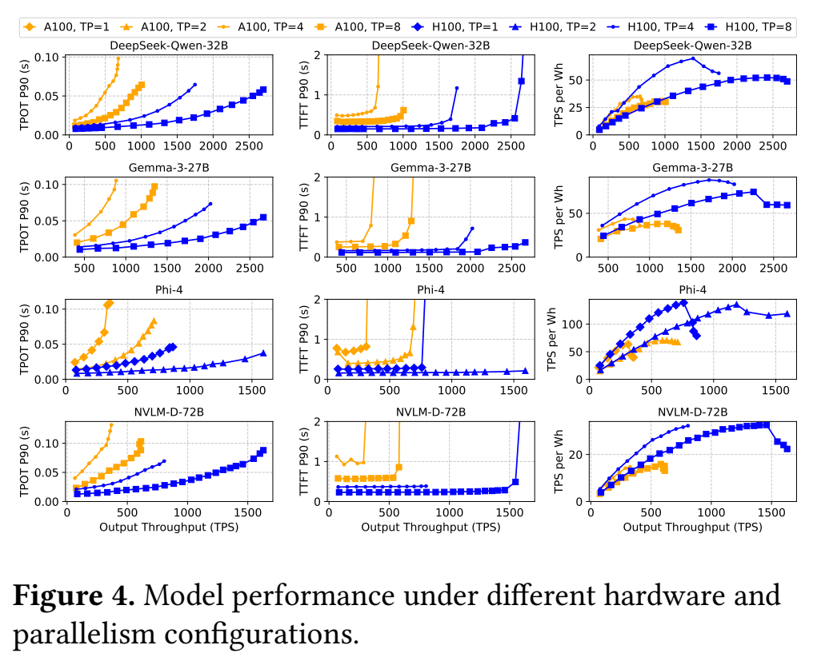

*原文 Figure 4，p.4。每行是一个模型；比较不同 GPU 与张量并行度在负载变化下的 TPOT、TTFT 和能效。TTFT/TPOT 图报告 P90。*

因此模型选择与 GPU 配置需要一起考虑。最低能耗的硬件配置也未必有最低租用费用。

#### Insight 3：候选组合很多，而且最合适的组合会变化

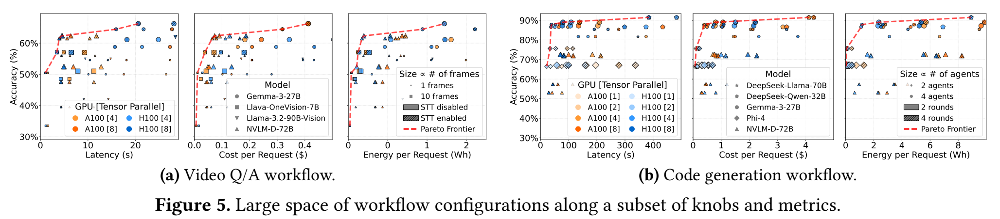

*原文 Figure 5，p.5。横轴分别是时延、费用和能耗，纵轴是准确率；颜色、形状和大小区分模型、硬件及工作流参数。*

一个点代表一种端到端配置。Pareto 前沿表示在所比较的两个指标上，没有其他候选方案能够两者都不差、且至少一个更好的配置集合；前沿上仍有多个方案，需要用户目标来决定取舍。

举例说明组合增长：若 STT 有 2 种选择、抽帧数有 3 种、模型有 4 种、GPU 有 2 种、并行度有 3 种，就有 2 × 3 × 4 × 2 × 3 = 144 种候选组合。这是解释性例子，不是论文的配置总数。更多节点拥有各自选项时，组合继续相乘；其中不兼容的组合还需过滤。

论文 Insight 3 的公式是在概括这种跨层组合增长，不应将它当作适用于任意工作流的精确复杂度公式。Murakkab 将人工决策自动化，但没有消除组合问题本身。

## 3. Design：从逻辑工作流到可执行工作流

### 3.1 Figure 6：三个阶段的整体关系

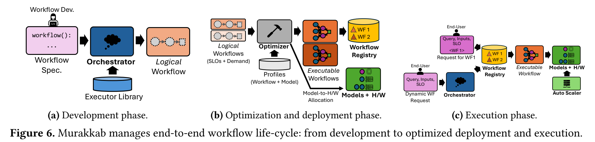

*原文 Figure 6，p.5。建议依次追踪 Workflow Spec. → Logical Workflow → Executable Workflow → Workflow Registry。*

| 阶段 | 输入 | 主要工作 | 产物 |
|---|---|---|---|
| (a) Development | 任务描述、可选的数据依赖、执行器库 | 理解任务并匹配执行器，检查连接 | 逻辑工作流 DAG |
| (b) Optimization and deployment | 逻辑工作流、SLO、需求、profiles、模型与硬件 | 选择参数、模型与部署资源 | 可执行工作流与模型到硬件的分配方案 |
| (c) Execution | 工作流 ID 或动态任务、输入、SLO | 查找执行方案、运行、监控和调整 | 用户结果及运行反馈 |

**逻辑工作流**表达功能和依赖；**可执行工作流**进一步绑定参数、具体模型及资源安排。开发者可以保留任务逻辑，让系统在不同负载或资源条件下重新选择执行方案。

### 3.2 Development：定义任务与构建逻辑图

#### 声明式规格与开发者控制

开发者可以使用自然语言描述任务，也可以明确拆分子任务和数据流。论文 Listing 2 的结构可以概括为：

```text
检测场景 → 抽取画面 ─┐
         → 转录音频 ─┴→ 结合信息回答问题
```

这里声明的是依赖：抽帧和转录都需要场景信息，问答需要两者的输出。是否可以并行由这些依赖决定，不应把这种图一概理解为全程串行执行。

开发者不必写死帧数、模型、硬件，也可以提出必须使用特定模型等限制。解耦意味着把这些偏好作为可见约束，保留系统在约束范围内优化的空间。

#### Executor：统一的功能构件

| 类型 | 含义 | 例子 |
|---|---|---|
| LLM | 为任务专门配置的模型能力；可以通过微调、few-shot 或领域 prompt 实现 | 视频问答、代码评审 |
| Structured composition | 按某种结构组织多个模型调用，对外表现为一个功能单元 | Self-reflection、LLM Debate |
| Tool | 数据处理、检索、外部操作及传统 ML 功能 | OpenCV 抽帧、搜索、MCP 工具、CNN 分类器 |

“LLM 执行器通常对应一次调用，Structured composition 包含多次调用”是有用的近似。严格区分依据是功能组织方式；组合内部可以多次调用同一个模型，也可以调用不同模型，不要求使用不同权重。

每个构件向系统暴露三个属性：

| 属性 | 用途 | 抽帧工具的例子 |
|---|---|---|
| 文字描述 | 判断能否完成子任务 | 从视频场景提取帧 |
| 接口规范 | 检查输入输出能否连接 | 输入场景，输出图像帧集合 |
| 可调参数 | 定义后续可优化的选项 | `F`：帧数；`cores`：CPU 核数 |

LLM Debate 则暴露 `D`（辩论者数量）、`R`（轮数）、`model`（模型）等参数。

#### Orchestrator 的职责与能力边界

Orchestrator 使用具有工具调用能力的 LLM，理解任务描述，根据执行器的功能和接口匹配构件，生成逻辑 DAG，并进行类型检查。发现上下游不兼容时，反馈错误尝试重新生成；持续失败时提示开发者修改。开发者也能检查和完善生成结果。

这里的关键设计是：**开放的任务描述映射到有限、已知的执行能力**。新任务可以组合已有构件；如果没有合适执行器，则需要开发者接入。系统不能凭空获得未注册工具的能力。

逻辑 DAG 本身不包含某次请求的具体 query、payload 或 SLO。部署后，用户通过 REST endpoint 提交请求和可选 SLO。具体参数及硬件选择主要留到优化阶段。

### 3.3 Optimization and Deployment：数据驱动的联合选择

#### 两层 profiles

Profile 是配置对应的实测效果档案。论文将质量和负载关系，与模型及硬件性能关系分开维护：

| 画像 | 记录内容 | 回答的问题 |
|---|---|---|
| Workflow profile | 不同工作流/执行器配置的质量，以及 prompt、completion token 等工作量 | 这样执行任务，质量够不够、产生多少负载？ |
| Model profile | 不同软件配置、硬件和负载下的吞吐、TTFT、TPOT、能耗与成本 | 承接这些负载，需要什么资源？ |

质量评估使用 VideoMME、HumanEval、MATH 等带有评估依据的数据集，也可以接入开发者数据和用户反馈。模型 profiles 可以跨工作流复用；引入新模型、硬件或影响效果的配置时，仍可能需要新的测量与选择性重新 profiling。

#### Figure 7：优化器的输入与输出

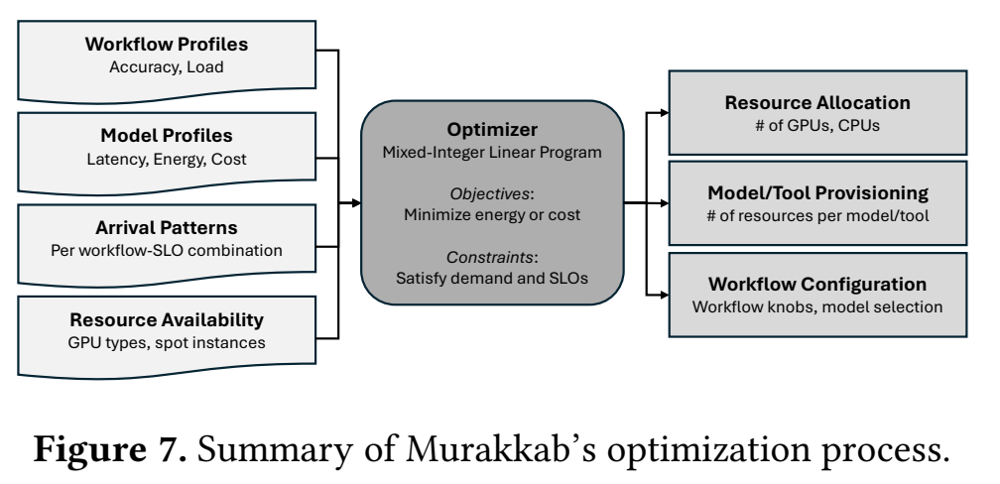

*原文 Figure 7，p.7。左侧的质量/负载、性能/费用、请求量和资源限制共同决定右侧部署方案。*

优化器综合逻辑工作流、两层 profiles、每个“工作流 × SLO”组合的到达模式和可用资源。它选择工作流参数、模型/工具、硬件与并行度，并确定模型实例数量和负载分配。

可以用下式理解其目标，但这只是概括，不是附录 MILP 的完整公式：

```text
最小化：总成本或总能耗
约束：质量达标、时延达标、容量承接需求、资源不超限
决策：工作流配置、模型及硬件配置、实例数、负载分配
```

论文采用 MILP（混合整数线性规划）求解资源分配问题，也支持给定成本预算下最大化质量。峰值需求用于容量规划，平均负载帮助估算使用情况和效率。

视频问答可以先过滤质量不够的方案，再用 token 分布和模型画像估计剩余方案的时延、成本，选择满足要求的配置；不可行时返回错误。优化器还联合考虑多个工作流：若它们能采用同一模型，可以共享模型实例，减少分别预留资源的浪费。

输出的可执行工作流按相应 SLO 档位登记到 Workflow Registry。**用于任务编排的 LLM 与用于资源决策的 MILP 是不同模块**，不能将整个优化过程都理解成让 LLM 猜配置。

### 3.4 Execution：按计划执行并持续适应

运行时有两条入口：已知工作流请求按 ID、输入和 SLO 查注册表执行；自然语言动态请求先经 Orchestrator 拆解，映射到现有执行器或工作流。

论文将质量与时延要求分为 best、good、fair、basic 四档，其阈值由候选配置的指标分布确定。它们不是通用服务标准；“95th percentile 档位”也不能直接解释为“95% 的线上请求必然达标”。

适应变化采用两个时间尺度：

| 机制 | 时间尺度 | 职责 |
|---|---|---|
| 周期性优化 | 实验默认每 60 分钟 | 根据近期负载预测和资源状况，重新选择配置、实例及分配方案，更新注册表 |
| Auto-scaler | 秒到分钟级监控窗口 | 检测实例负载变化，按性能画像阈值快速扩容，优先避免 SLO 违约 |

系统还保留备用资源，负载或资源使用偏差明显时可提前重新优化。“短窗口发现需要扩容”不代表冷启动实例瞬间可用；后续 §4.6 明确考虑了实例准备时间。

### 3.5 三个 Insight 如何落实到设计

| 问题 | 对应机制 | 获得的能力 |
|---|---|---|
| Insight 1：看不全、控制分散 | 声明式描述、逻辑 DAG、编排与资源管理贯通 | 同时理解任务依赖、用户要求和资源条件 |
| Insight 2：多目标互相权衡 | 两层 profiles、SLO 约束、跨层选择 | 把质量、工作量和资源成本连接起来比较 |
| Insight 3：组合过多且环境变化 | 自动优化、注册表、周期重优化、扩容 | 将配置选择交给系统，并在环境变化后更新 |

这些机制相互配合，不能严格认为一个模块只解决一个 Insight。性能画像提高决策依据的可复用性，但仍有测量成本；MILP 自动化决策，但不意味着任意规模都能快速求解或预测永远准确。

## 4. Evaluation：每组实验验证什么？

### 4.1 实验设置：先理解比较口径

| 项目 | 原文设置 |
|---|---|
| GPU | Azure A100/H100 虚拟机，每台 8 张 80GB GPU |
| CPU | A100 VM：AMD EPYC 7V12 64 核；H100 VM：Intel Xeon Sapphire Rapids |
| 软件 | vLLM 0.9；speaches-ai 0.7；OmDet |
| 负载 | 2024 年 5 月 Azure LLM 服务的 24 小时聊天与编码到达轨迹 |
| 映射 | 聊天请求 → 视频问答；编码请求 → 代码生成 |
| 主实验工作流 | 视频问答、代码生成；附录补充数学问答 |
| 默认优化周期 | 60 分钟 |

三种策略分别是：

- **Static**：作者人工设置的 Gemma-3-27B + A100 固定方案，旨在兼顾质量与成本，缺少按负载和请求 SLO 调整的能力。
- **Mrkb Opt**：分别优化各个“工作流 × SLO”组合。
- **Mrkb Opt+Mult**：联合优化全部组合，进一步共享模型实例。

生产轨迹提供真实的到达模式，但任务映射是实验构造，并非生产 Agent 完整执行轨迹。Static 用来代表静态部署方式，不能视为对所有充分调优的 LangGraph 部署的普遍比较。

### 4.2 单工作流：放宽目标带来多少配置空间？

每次实验中，同一工作流的请求具有相同 SLO；作者分别以最小能耗和最低成本为目标优化。

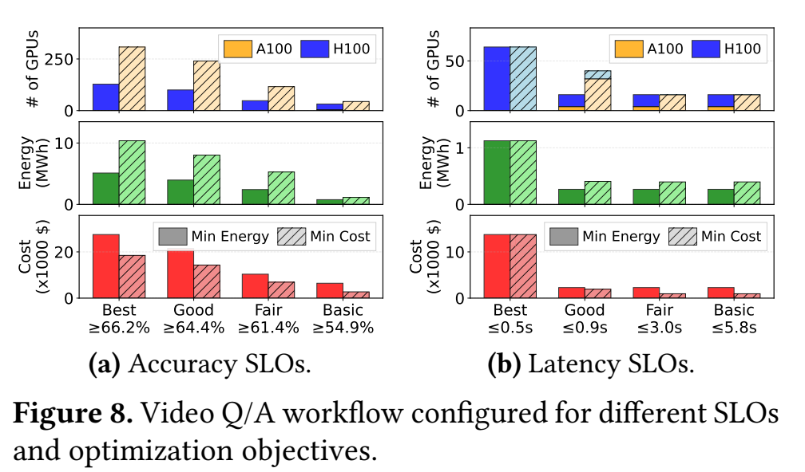

*原文 Figure 8，p.8。左侧改变准确率门槛，右侧改变时延门槛；实心/斜线柱区分最小能耗和最低成本目标，GPU 部分区分 A100/H100。*

- 视频问答准确率要求从 **66.2% 放宽到 64.4%** 时，最小能耗方案从 **5.1 降至 3.9 MWh**，约减少 23.5%。对应最低成本方案从 **18.5 降至 14.3 千美元**。
- 时延要求从 **0.5 秒放宽到 0.9 秒**，能耗从 **1.1 MWh 降至 266 kWh**。时延实验仍保留最低质量要求。

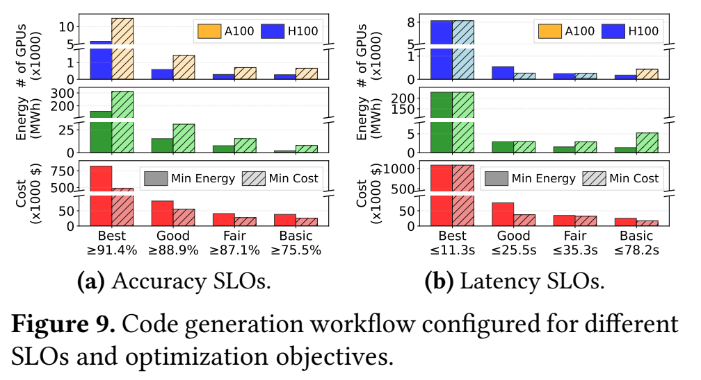

*原文 Figure 9，p.8。注意纵轴单位与断轴，避免将柱高直接当作线性倍数。*

代码生成质量档位从 **91.4% 放宽到 88.9%** 后，能耗和成本分别降低约 **10.5 倍、8.7 倍**，主要来自 DeepSeek-Qwen-32B 到 Gemma-3-27B 的切换，减少了 token 和运算开销。

**这里验证的是 SLO 放宽后优化器能抓住节省机会。**它没有证明在完全相同质量下也能获得这些倍数。判断结果时，应将质量变化与系统效率变化一起报告。

### 4.3 多工作流：自动优化与共享实例分别带来什么？

视频问答与代码生成混合运行，70% 请求要求高准确率，30% 要求低时延，两类都采用对应的 good 档位。

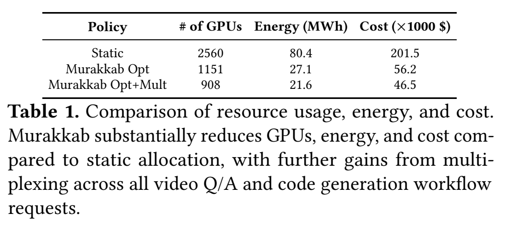

*原文 Table 1，p.9。以下转录便于检索与计算；GPU 一栏沿用论文的报告口径。*

| 策略 | GPU 数（原文报告） | 24 小时能耗 | 成本 |
|---|---:|---:|---:|
| Static | 2,560 | 80.4 MWh | 201.5 千美元 |
| Opt | 1,151 | 27.1 MWh | 56.2 千美元 |
| Opt+Mult | 908 | 21.6 MWh | 46.5 千美元 |

相对 Static，Opt+Mult 的 GPU、能耗、成本降至约 **1/2.8、1/3.7、1/4.3**，对应约 **64.5%、73.1%、76.9%** 的下降；百分比根据表中四舍五入后的值计算。这是摘要主要倍数的来源。

Opt+Mult 相对 Opt 进一步减少约 **21.1% GPU、20.2% 能耗、17.3% 成本**。前一阶段收益包含按 SLO 和负载调整配置，后一阶段展示跨工作流共享的额外收益。

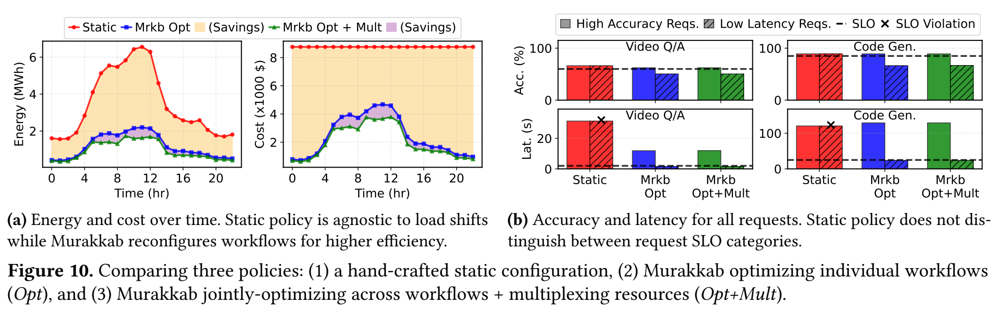

*原文 Figure 10，p.10。(a) 看全天能耗/费用变化；(b) 同时检查质量和时延，虚线表示 SLO，红色斜线标识违约。*

Static 对高质量和低时延请求使用同一配置，导致部分时延要求不满足。Murakkab 能区分请求要求并选择不同配置。因此，主实验不是“所有基线都已达到相同服务质量后只比较成本”的对照。

### 4.4 可用硬件变化：最低能耗与最低费用不同

固定可用 A100 上限为 2,000 张，将可用 H100 从 0 增加至 500 张，每次增加 100 张，并要求最小化能耗。

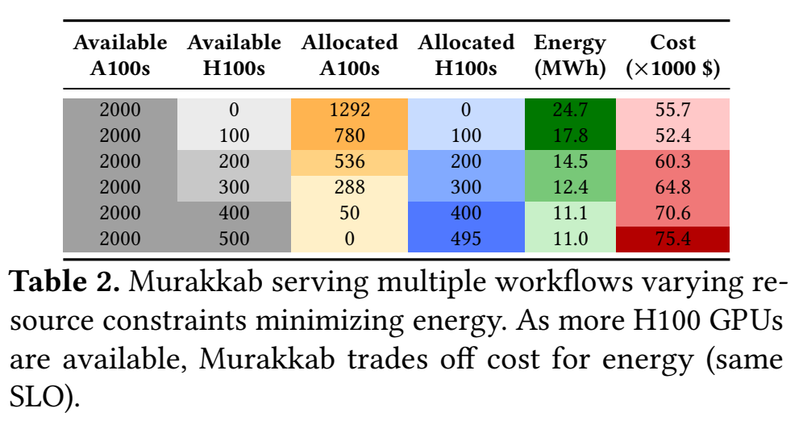

*原文 Table 2，p.9。区分 Available（可用上限）与 Allocated（实际分配）。*

从无 H100 到可用 500 张 H100，方案由 **1,292 张 A100** 转为 **495 张 H100**；能耗由 **24.7 降至 11.0 MWh**，费用由 **55.7 升至 75.4 千美元**。这个结果展示能效与价格的不同，也说明优化目标会直接影响硬件选择。

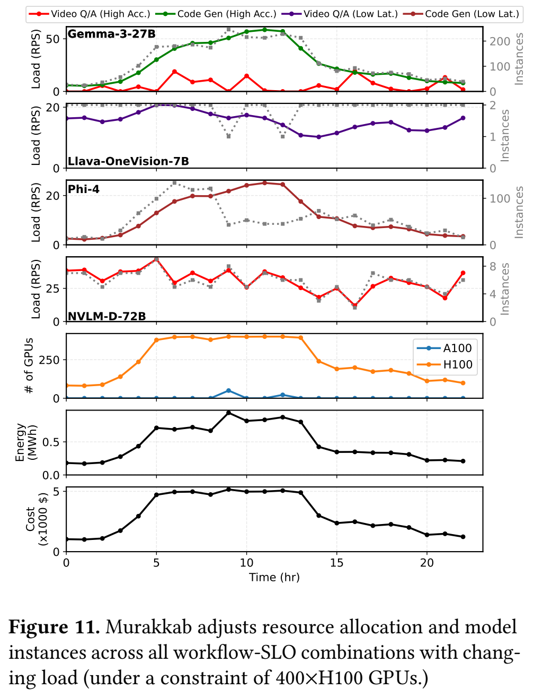

*原文 Figure 11，p.10，在最多 400 张 H100 的设置下。上半部分看不同工作流的负载如何汇聚到模型；下半部分看实例、GPU、能耗和费用随时间变化。*

系统可以让 Gemma 同时承接代码生成与视频问答的高质量请求，并根据余量调整共享。Table 2 主要是不同资源上限的场景比较；不要直接把它解读成任意时刻突然丢失 GPU 时的故障恢复测量。

### 4.5 DAG 感知调度：把资源花在影响完成时间的位置

任务是“验证视频中学生的代码”，要求 30 秒内完成。视频处理与参考代码生成形成并行分支。

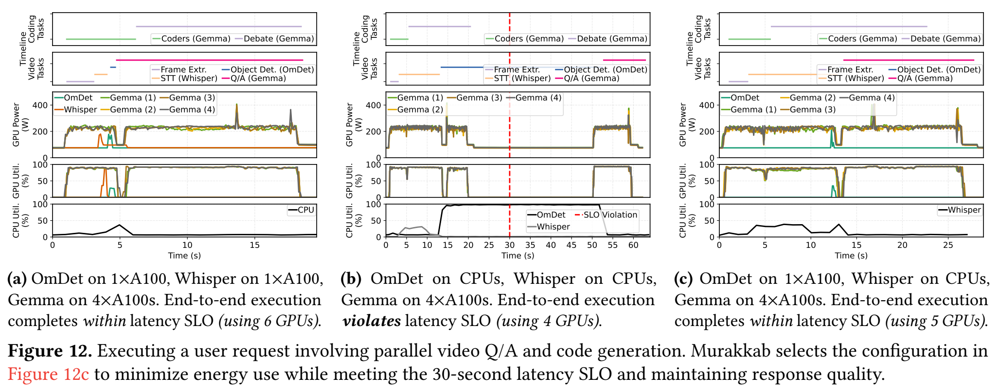

*原文 Figure 12，p.11。每列比较任务时间线、GPU 功率、GPU 与 CPU 利用率；三列横轴范围不同，不能仅凭条形长度比较时延。*

| 方案 | 资源 | 是否满足 30 秒要求 |
|---|---|---|
| (a) Whisper、OmDet 均使用 GPU，Gemma 使用 4 张 GPU | 共 6 张 A100 | 满足，但部分 GPU 利用率低 |
| (b) Whisper、OmDet 均使用 CPU，Gemma 使用 4 张 GPU | 共 4 张 A100 | OmDet 在 CPU 上过慢，违约 |
| (c) Whisper 使用 CPU、OmDet 使用 GPU，Gemma 使用 4 张 GPU | 共 5 张 A100 | 满足，并减少 GPU 使用 |

Whisper 转到 CPU 后变慢，仍能留在任务允许的时间范围内；OmDet 转到 CPU 则拖慢整个工作流。论文选择 (c)，说明 DAG 可见性能够指导异构资源分配。这是具体案例证据，不应外推为任何 DAG 都能获得相同节省。

### 4.6 优化周期：适应速度与切换开销之间的权衡

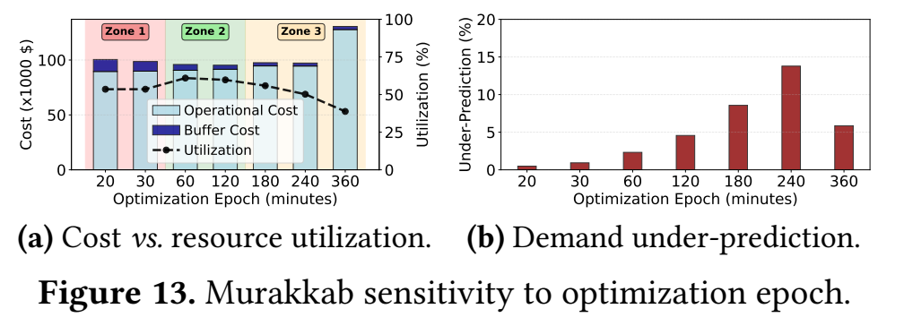

*原文 Figure 13，p.11。(a) 是成本与利用率；(b) 是需求低估比例。*

实验比较 20 分钟到 6 小时的周期，假设实例准备需要 20 分钟，使用 EWMA（α = 0.5）预测需求。

- **周期过短**：切换频繁，过渡期额外资源和部署成本较高，缓存复用也可能受影响。
- **中等周期**：部署开销与预测误差之间取得较好平衡；实验中约 60 分钟的利用率较好。
- **周期过长**：配置难以跟随实际流量，可能产生过度配置或容量不足。

Figure 13(b) 的 under-prediction 表示如果没有自动扩容补救，需求低估可能导致无法承接的请求；它不是完整系统实测的丢请求率。60 分钟是在该负载和实例启动假设下的选择，并非通用最优值。

## 5. 结论与阅读评价

### 5.1 作者的结论

Murakkab 将声明式工作流与自适应运行时结合，打通工作流编排和集群管理，在满足不同 SLO 的前提下动态调整配置、提高资源效率。作者提出的未来方向包括更大集群、更多异构加速器，以及针对新 Agent 工作负载的专门优化。

### 5.2 从讨论中提炼的五个系统洞察

以下是导读的归纳，不是额外的实验结论。

1. **任务结构本身就是优化信息。** 数据依赖、并行分支和最终目标决定了哪些局部加速有价值；只看单次调用容易分配错资源。
2. **SLO 将质量需求转化为可利用的配置空间。** 达标后无需继续无条件堆叠资源；但应明确比较是否放宽了质量要求。
3. **模型选择同时也是容量规划。** 模型变化会改变 token 分布、调用开销及所需实例数，不能把模型选择与硬件选择完全分开。
4. **共享机会可以通过联合配置创造。** 多个工作流选择兼容的模型配置后，可共享实例；并非只能在固定模型选择后做资源装箱。
5. **长期计划与短期反馈需要配合。** 离线画像支持配置比较，周期优化响应趋势，监控和备用容量承接短时偏差。三者的误差与切换成本都需要纳入考虑。

### 5.3 结论适用到哪里？

- **质量画像具有数据分布前提。** 公共数据集准确率不能保证任意新任务的质量；新工作流、模型、prompt 或数据分布可能需要重新评估。
- **大幅节省包含多种来源。** 模型变化、SLO 区分、资源调整和共享共同发生；摘要倍数不是某个单独调度算法的纯收益。
- **负载轨迹经过任务映射。** 对真实到达波动的适应有证据，但对所有生产 Agent 的工具时间、循环深度和长尾控制流尚不能直接外推。
- **优化依赖可观察和可控制的边界。** 对完全外部托管的模型 API，可以估计费用和性能，但不能像自管实例一样任意调整其底层 GPU。
- **有限执行器库限制可执行能力。** 自然语言任务可以开放，底层能力仍需要注册、接口验证和性能数据支持。
- **自动化不等于消除优化复杂度。** 要评估更大规模的适用性，还需要关注 profiling 成本、预测误差、求解时间及部署切换开销。

### 5.4 容易误读的说法及修正

| 容易误读 | 更准确的表述 |
|---|---|
| “命令式程序不能自动优化” | 本文批评的是任务逻辑、固定配置与分散控制相结合的部署方式 |
| “Orchestrator 负责选几张 GPU” | 它主要构建逻辑 DAG；具体参数与资源由后续优化器决定 |
| “每个请求都调用 LLM 和 MILP 重新编排” | 已部署工作流通常按 ID/SLO 查注册表；动态任务与后台重优化是另外的路径 |
| “准确率 SLO 保证这道题正确” | 它依赖评估数据上的统计质量及其代表性 |
| “Structured composition 一定使用不同模型” | 可以重复调用同一个模型，也可以使用多个不同模型 |
| “自动扩容监控快，所以实例也立即启动” | 检测与资源就绪是不同过程，备用资源和切换时间都影响响应 |
| “节省 4.3 倍成本适用于任何现有框架” | 它是特定负载、SLO 与静态基线下的比较结果 |
| “最高质量稍降后的收益是同质量加速” | 4.2 放宽 SLO 的收益与 4.3 系统策略比较应分别报告 |

## 6. 术语速查与复习问题

| 术语 | 在本文中的意思 |
|---|---|
| Agentic workflow | 协同完成任务的模型、Agent 和工具调用结构 |
| Tenant | 独立服务使用方，可能是用户、团队、企业或应用 |
| SLI / SLO / SLA | 实测指标 / 目标阈值 / 正式服务协议 |
| Knob | 系统可以调整的参数或配置选项 |
| Executor | 承担子任务的功能单元，可为 LLM、组合模式或工具 |
| Orchestrator | 理解任务、匹配执行器、构建并检查逻辑工作流 |
| Logical workflow | 尚未完成具体部署配置的任务依赖图 |
| Profile | 某类配置的实测质量、负载或性能档案 |
| Optimizer | 在 SLO、负载与资源约束下选择执行和部署方案 |
| Executable workflow | 已确定执行参数、模型与资源安排的工作流 |
| Registry | 保存已准备好执行方案的工作流注册表 |
| Multiplexing | 不同工作流或请求类别共享模型实例容量 |
| Tensor parallelism | 将模型的张量计算分散到多张 GPU 上执行 |
| TTFT / TPOT | 首个 token 的等待时间 / 每个输出 token 的时间 |
| CDF / long tail | 累积分布 / 少数请求显著高于典型值的尾部 |
| MILP | 包含整数决策变量的线性规划，此处用于资源与负载分配 |

复习时可用以下问题检查是否抓住主线：

1. 为什么只优化单次模型调用，可能无法改善整个 Agent 任务？
2. 逻辑工作流与可执行工作流分别固定了什么、保留了哪些自由度？
3. 为什么 workflow profile 与 model profile 要分开维护？
4. 相同模型为什么可能同时适合视频问答与代码生成？共享后省的是什么？
5. 为什么最低能耗配置不一定最低价？
6. 4.2、4.3 和 4.5 分别支持了什么结论，各自不能证明什么？

## 附：截图索引

所有 PNG 均与本文同目录，文件名对应原文编号。

| 原文 | PDF 页码 | 文件 |
|---|---:|---|
| Figure 1 | 1 | [割裂的技术栈](./figures/figure-01-fragmented-stack.png) |
| Figure 2 | 2 | [示例工作流](./figures/figure-02-example-workflows.png) |
| Figure 3 | 4 | [准确率与 token 分布](./figures/figure-03-quality-token-tradeoffs.png) |
| Figure 4 | 4 | [硬件性能权衡](./figures/figure-04-hardware-tradeoffs.png) |
| Figure 5 | 5 | [配置空间](./figures/figure-05-configuration-space.png) |
| Figure 6 | 5 | [工作流生命周期](./figures/figure-06-workflow-lifecycle.png) |
| Figure 7 | 7 | [优化器](./figures/figure-07-optimizer.png) |
| Figure 8 | 8 | [视频问答 SLO](./figures/figure-08-video-slos.png) |
| Figure 9 | 8 | [代码生成 SLO](./figures/figure-09-code-slos.png) |
| Table 1 | 9 | [整体结果](./figures/table-01-overall-results.png) |
| Table 2 | 9 | [资源可用性](./figures/table-02-resource-availability.png) |
| Figure 10 | 10 | [多工作流结果](./figures/figure-10-multi-workflow-results.png) |
| Figure 11 | 10 | [动态调整](./figures/figure-11-runtime-adaptation.png) |
| Figure 12 | 11 | [DAG 感知调度](./figures/figure-12-dag-aware-scheduling.png) |
| Figure 13 | 11 | [优化周期](./figures/figure-13-optimization-frequency.png) |
