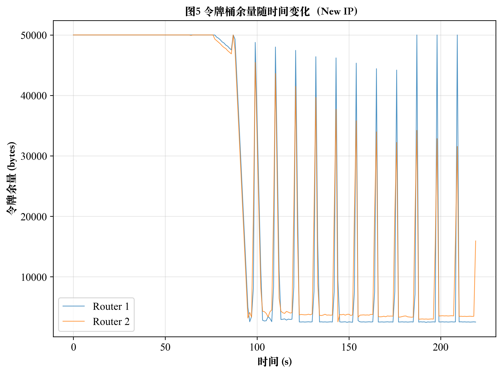

This is Part 2 of a three-part series. [Part 1](../router1) introduced the problem and the overall design concept. Here I focus on the runtime control logic: how the router senses congestion and decides when to start trimming.

---

## What the Router Needs to Figure Out

Trimming a packet is straightforward once the decision is made. The harder problem is knowing *when* to start, and *how aggressively* to do it. Too conservative and the buffer still overflows; too aggressive and you're degrading traffic unnecessarily.

A real router can observe its own queue depth — that's what AQM algorithms like RED and CoDel do. But in this prototype, the "router" is an XDP program running inside a container. It has no visibility into the kernel's actual transmit queue length. I needed a different congestion signal.

---

## Why XDP Instead of `tc`

Before getting to the congestion model, I should explain why XDP is the processing layer at all.

My first attempt used Linux **traffic control** (`tc`) with a `cls_bpf` classifier. It works, and the BPF API is similar. But `tc` hooks into the network stack *after* the kernel has already allocated an `sk_buff` for the packet and handed it up through the protocol layers. By the time your BPF program runs, a fair amount of kernel work has already happened — work you can't undo.

**XDP** attaches directly to the NIC driver, before any of that. The program runs on the raw DMA buffer as soon as the packet arrives:

```
Ingress
  NIC driver (RX)
       │
       ▼
  ┌──────────────────────────────────────┐
  │  XDP hook  ← our program runs here  │
  │  · read packet bytes directly        │
  │  · trim tail: bpf_xdp_adjust_tail()  │
  │  · drop:      return XDP_DROP        │
  │  · pass:      return XDP_PASS        │
  └──────────────────┬───────────────────┘
                     │ XDP_PASS
                     ▼
             Kernel IP stack
             (sk_buff allocated here)
```

If we decide to drop or trim the packet, we return `XDP_DROP` or call `bpf_xdp_adjust_tail()` before the kernel touches it. No wasted allocation, no wasted protocol processing.

The tradeoff: the BPF verifier is stricter at XDP than at `tc`. Every memory access must be bounds-checked, loops must have a statically provable upper bound, and you can't call arbitrary kernel helpers. These constraints shaped a lot of the implementation decisions described in Part 3.

---

## The Token Bucket as a Congestion Proxy

Without queue depth visibility, I used a **token bucket** to simulate congestion. The idea: the bucket represents the router's available forwarding budget (in bytes). Every packet that passes through consumes tokens equal to its size. A userspace daemon refills the bucket periodically at a fixed rate.

```
Token bucket parameters (forwarder_user.c):

  token_max          = 50000 bytes   (bucket capacity)
  token_recover_rate = 50000 bytes/s (refill rate)
  TOKEN_LOW_WATERMARK = 3000 bytes   (congestion threshold)
  update_period      = 50 ms         (refill interval)
```

When traffic is light, tokens refill faster than they're consumed — the bucket stays near full. When traffic exceeds the configured rate, the XDP program drains tokens faster than the daemon can refill them — the bucket level drops toward zero.

The bucket level is the congestion signal. Instead of "queue is 80% full," the signal becomes "tokens are below the waterline."

---

## The Two-Process Split

The core design split the router into two cooperating processes:

```
┌─────────────────────────────────────────────────────┐
│                   Kernel space                       │
│                                                      │
│  XDP program (forwarder.bpf.c)                      │
│  · per-packet: check token level                    │
│  · per-packet: probabilistic trim decision          │
│  · per-packet: apply trim or drop                   │
│  · per-packet: atomic token deduction               │
│                                                      │
│  BPF maps (shared memory):                          │
│    token_map       ← current token count (s64)      │
│    clean_ratio_map ← trim probability (0–10000)     │
│    stats_map       ← per-CPU throughput counters    │
│    clean_stats_map ← per-CPU trim/drop counters     │
└────────────────────────┬────────────────────────────┘
                         │ bpf_map_lookup/update_elem
┌────────────────────────▼────────────────────────────┐
│                  Userspace daemon                    │
│  (forwarder_user.c)                                  │
│                                                      │
│  Every 50 ms:                                        │
│  · read token_map                                    │
│  · add refill = recover_rate × 0.05                 │
│  · clamp to token_max                               │
│  · adjust clean_ratio based on token level          │
│  · write back token_map and clean_ratio_map         │
│                                                      │
│  Every 1 s:                                          │
│  · read stats_map, clean_stats_map                  │
│  · log snapshot to JSON file                        │
└─────────────────────────────────────────────────────┘
```

This split keeps the hot path (XDP) minimal and fast. The control logic — which involves floating-point math, file I/O, and proportional feedback — lives entirely in userspace where none of the BPF verifier constraints apply.

---

## Token Consumption in the Hot Path

The XDP program consumes tokens atomically for each passing packet:

```c title="forwarder/forwarder.bpf.c"
static __always_inline int try_consume_token(__u32 bytes)
{
    __u32 key = 0;
    __s64 *tok = bpf_map_lookup_elem(&token_map, &key);
    if (!tok)
        return 0;

    if (*tok < (__s64)bytes)
        return 0;  /* not enough tokens → caller will drop */

    __sync_fetch_and_add(tok, -(__s64)bytes);  /* atomic decrement */
    return 1;
}
```

`__sync_fetch_and_add` is a GCC atomic builtin that the BPF verifier accepts and translates into a lock-free atomic instruction. No spinlocks, no per-CPU duplication needed for the token counter — concurrent XDP invocations on different CPUs all safely compete for the same token pool.

The stats counters (`stats_map`, `clean_stats_map`) use `BPF_MAP_TYPE_PERCPU_ARRAY` instead, because they're write-heavy and don't need cross-CPU consistency. Each CPU writes to its own slot; the userspace daemon sums them up during the 1-second snapshot.

---

## Adjusting the Cleaning Probability

The cleaning probability (`clean_ratio`, 0–10000 representing 0–100%) is updated every 50 ms by the userspace daemon based on how far the token level is from the waterline:

```c title="forwarder/forwarder_user.c" {4-5,10-11}
if (cur_tokens < TOKEN_LOW_WATERMARK) {
    /* tokens running low → ramp up cleaning */
    __s64 gap  = TOKEN_LOW_WATERMARK - cur_tokens;
    __s32 step = (gap * CLEAN_RATIO_MAX) / TOKEN_LOW_WATERMARK;
    if (step < CLEAN_RATIO_STEP) step = CLEAN_RATIO_STEP;
    cur_clean_ratio += step;
} else {
    /* tokens recovering → back off cleaning */
    __s64 surplus = cur_tokens - TOKEN_LOW_WATERMARK;
    __s32 step    = (surplus * CLEAN_RATIO_MAX) / TOKEN_LOW_WATERMARK;
    if (step < CLEAN_RATIO_STEP) step = CLEAN_RATIO_STEP;
    cur_clean_ratio = (cur_clean_ratio >= step) ? cur_clean_ratio - step : 0;
}
bpf_map_update_elem(clean_ratio_fd, &key0, &cur_clean_ratio, BPF_ANY);
```

The step size is proportional to the gap from the waterline, with a minimum floor (`CLEAN_RATIO_STEP = 100`, i.e. 1%). This creates a negative feedback loop:

- Traffic surge → tokens deplete → `gap` grows → `clean_ratio` rises fast
- Trimming kicks in → packets shrink → fewer bytes consumed → tokens recover
- Token level crosses waterline → `clean_ratio` backs off
- Light traffic → bucket stays full → `clean_ratio` holds at 0

Back in the XDP program, each packet makes a probabilistic trim decision using `bpf_ktime_get_ns()` as a cheap random source:

```c title="forwarder/forwarder.bpf.c"
__u32 ratio = get_clean_ratio();
int should_clean = 0;
if (ratio >= 10000) {
    should_clean = 1;
} else if (ratio > 0) {
    __u32 rand = (__u32)bpf_ktime_get_ns();
    should_clean = (rand % 10000) < ratio;
}
```

---

## Drift-Free Scheduling

One subtle issue: if the 50 ms timer fires slightly late each iteration (which `sleep()`-based loops tend to do), the accumulated drift means the token refill rate is slower than intended, making the system look permanently congested.

The fix is to schedule against an *absolute* clock rather than a *relative* one:

```c title="forwarder/forwarder_user.c"
struct timespec next_update;
clock_gettime(CLOCK_MONOTONIC, &now);
next_update = timespec_add_sec(now, update_period);  /* absolute target */

while (!stop) {
    clock_nanosleep(CLOCK_MONOTONIC, TIMER_ABSTIME, &next_update, NULL);
    /* ... do work ... */
    next_update = timespec_add_sec(next_update, update_period);  /* advance by fixed step */
}
```

`TIMER_ABSTIME` tells the kernel to wake at a specific point in time, not "N nanoseconds from now." Advancing `next_update` by a fixed step each iteration means any lateness in one cycle doesn't compound into the next.

---

## What It Looks Like at Runtime

The plot below shows the token level on both routers over a 225-second run where the sender steadily increases its packet rate until it saturates the link (around t = 80 s), then continues sending at maximum rate.



Both routers start with full buckets. Once the traffic rate exceeds the token refill rate, the level collapses toward zero and the feedback loop kicks in — the sawtooth pattern is the system repeatedly trimming traffic until tokens recover, then relaxing, then trimming again. Router 2 (downstream) mirrors Router 1 closely because it sees the same traffic stream; in practice, packets trimmed by Router 1 arrive at Router 2 smaller, so Router 2's bucket drains slightly more slowly.

---

Part 3 covers what actually happens when `should_clean = 1` — how the XDP program walks the chunk list, finds the trim point, and physically shrinks the packet using `bpf_xdp_adjust_tail()`.
